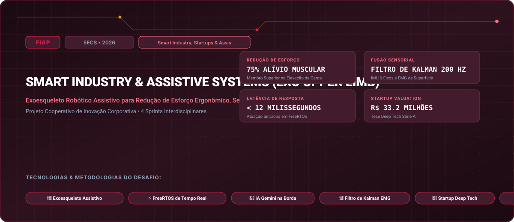

# FIAP • Smart Industry & Assistive Systems (Exo Upper Limb) (2026)

> **Engenharia da Computação — FIAP (Faculdade de Informática e Administração Paulista)**  
> **Turma:** 5ECS • Ano Letivo 2026  
> **Empresa Parceira do Desafio:** Smart Industry, Startups & Assistive Systems  
> **Portal Interativo GitHub Pages:** [https://guimemee.github.io/fiap-challenge-2026-smart-industry/](https://guimemee.github.io/fiap-challenge-2026-smart-industry/)

---

## 📋 Sumário Executivo do Projeto Cooperativo

Este repositório consolida o projeto de inovação corporativa interdisciplinar desenvolvido para a empresa parceira **Smart Industry, Startups & Assistive Systems**, integrando:
1. **4 Sprints Oficiais:** Modelagens matemáticas no padrão Symbolab, especificações técnicas originais, gráficos e cadernos Jupyter (`Resolucao_Calculos.ipynb`).
2. **Documentação e Entregas FIAP:** Apresentações de pitch deck, diagramas arquiteturais e relatórios de validação técnica.
3. **Hardware e Firmware:** Simulações e códigos integrando robótica, telecomunicações, inteligência artificial e computação em nuvem.

---

## 🎯 As 4 Sprints do Desafio

- **Sprint 1:** Sprint 1: Modelagem Biomecânica Muscular do Membro Superior e Redutores &rarr; [`Sprints/Sprint_1_cp1/Resolucao_Calculos.ipynb`](Sprints/Sprint_1_cp1/Resolucao_Calculos.ipynb)
- **Sprint 2:** Sprint 2: Aquisição e Filtragem de Sinais EMG com Filtro de Kalman em FreeRTOS &rarr; [`Sprints/Sprint_2_cp2/Resolucao_Calculos.ipynb`](Sprints/Sprint_2_cp2/Resolucao_Calculos.ipynb)
- **Sprint 3:** Sprint 3: Controle Adaptativo de Impedância e IA Gemini para Fadiga &rarr; [`Sprints/Sprint_3_cp3/Resolucao_Calculos.ipynb`](Sprints/Sprint_3_cp3/Resolucao_Calculos.ipynb)
- **Sprint 4:** Sprint 4: Estruturação da Startup Deep Tech, Valuation DCF e Pitch Deck &rarr; [`Sprints/Sprint_4_cp4/Resolucao_Calculos.ipynb`](Sprints/Sprint_4_cp4/Resolucao_Calculos.ipynb)

---

## 🏛️ Créditos e Rastreabilidade
- **Instituição:** FIAP (Faculdade de Informática e Administração Paulista)
- **Curso:** Bacharelado em Engenharia da Computação
- **Turma:** 5ECS • Ano Letivo 2026
- **Aluno:** Guilherme Macário da Silva ([@Guimemee](https://github.com/Guimemee))
